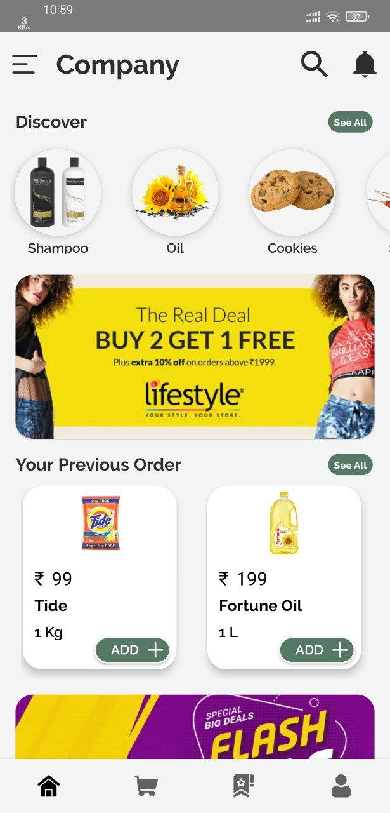
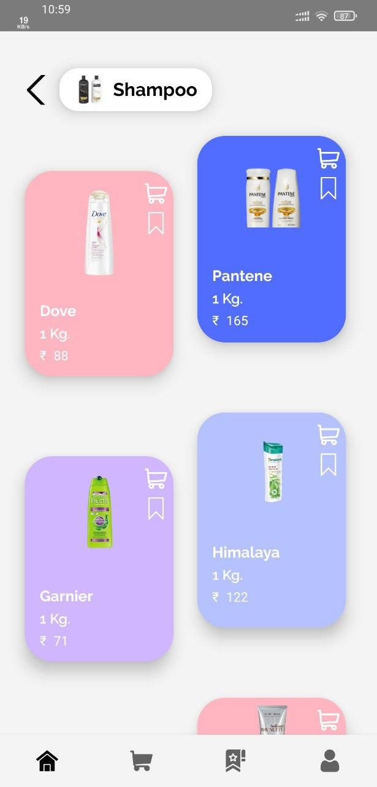
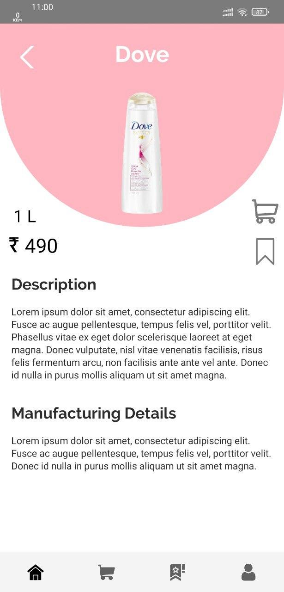
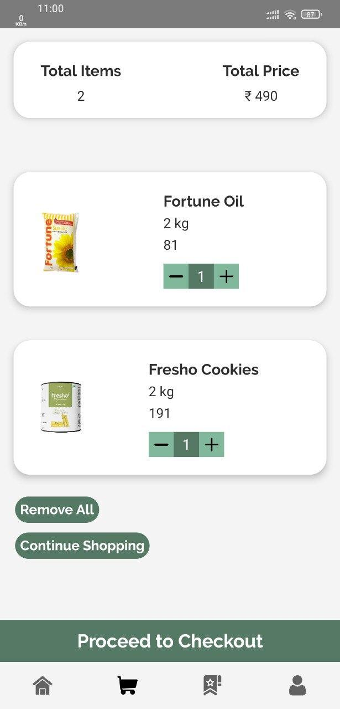
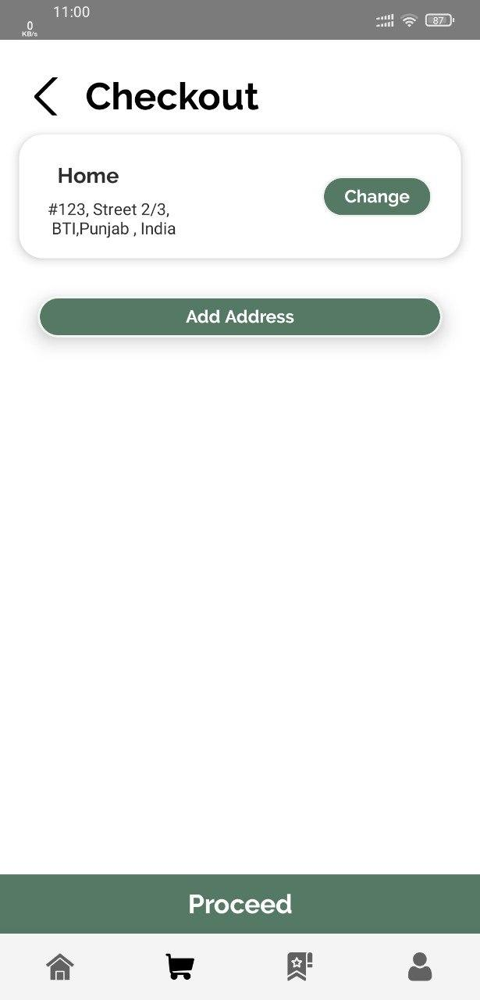

# E-Commerce Demo App
App Has <b>UI Animations</b> Too!

[](https://github.com/Shabinder/SpotiFlyer/releases)


To <b>Try</b> the App : Download Apk from here: [this link](https://github.com/Shabinder/E-Commerce-Demo-App/releases/latest)

## ScreenShots 
<table style="width:100%">
  <tr>
    <th>1. Nav Drawer</th>
    <th>2. Home Screen</th>
    <th>3. List Screen</th> 
  </tr>
  <tr>
    <td></td>
    <td></td>
    <td></td> 
  </tr>
</table>

<table style="width:100%">
  <tr>
    <th>4. Product Screen</th>
    <th>5. Cart Screen</th> 
    <th>6. Checkout Screen </th> 
  </tr>
  <tr>
    <td></td>
    <td></td> 
    <td></td> 
  </tr>
</table>


Disclaimer
----
```
NOTE All PRICES AND PRODUCT IMAGES ARE FOR DEMO SAKE ONLY!
The Info About them maybe Incorrect.
```

License
----
**GPL-3.0 License**
This program is free software: you can redistribute it and/or modify it under the terms of the GNU General Public License as published by the Free Software Foundation, either version 3 of the License, or (at your option) any later version.

***Free Software, Hell Yeah!***
